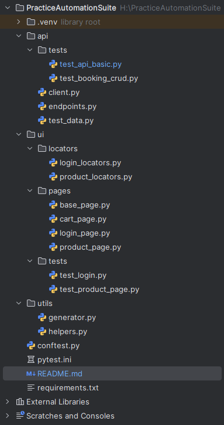

Automation Test Suite

This project contains automated tests for a web application UI (Saucedemo) + API (jsonplaceholder) practice after AQA course

UI tests verify main user scenarios on a website (login, creating posts, checking page elements, etc.).
API tests verify the functionality of the REST API: creating, retrieving, updating, and deleting posts.

*Technology Stack
- Python 3.11
- pytest
- requests
- selenium
- webdriver-manager

*Installing Dependencies

pip install -r requirements.txt

*Running UI Tests

1.Install dependencies.

2.Run all UI tests:

pytest tests/ui

*Running API Tests

1.Install dependencies.

2.Run all API tests:

pytest tests/api

3.Run a specific test:

pytest tests/api/test_get_posts.py::test_get_posts_list

*Project Structure

List of Tests
UI Tests (https://www.saucedemo.com/)

1. User login verification
2. Error messages when invalid data
3. Loading market after login
4. Items price is visible
5. User can add items in cart

API Tests (https://jsonplaceholder.typicode.com)

1. Get all posts (GET /posts)
2. Get a single post by ID (GET /posts/{id})
3. Create a new post (POST /posts)
4. Delete a post (DELETE /posts/{id})
5. Negative test: request a non-existent post (GET /posts/9999 → 404)

